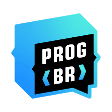
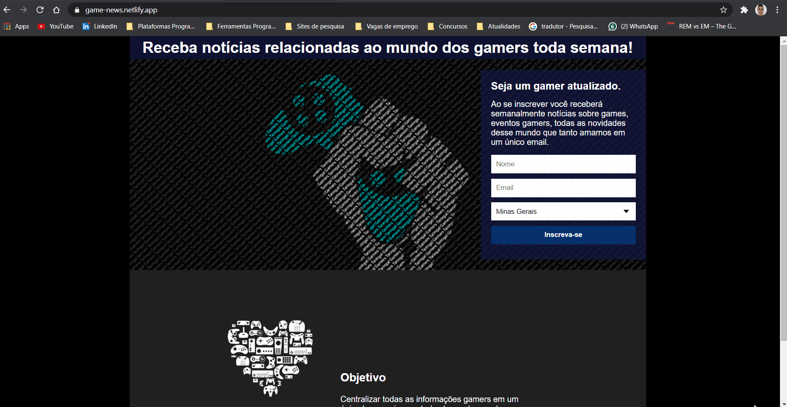
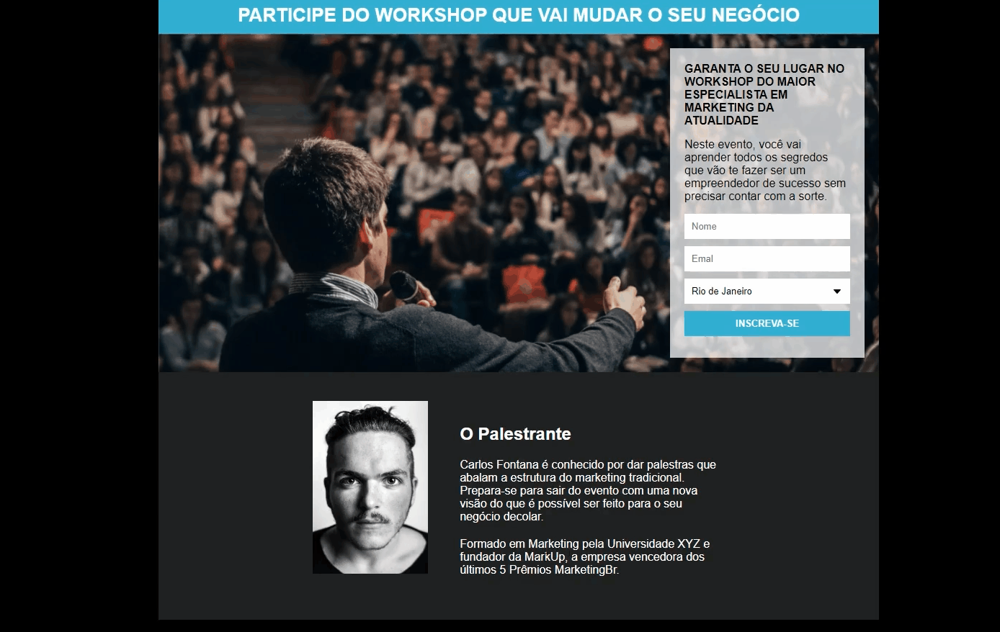

<h1 align="center">
<strong> Game News </strong>

 

</h1>

<h2 align="center"> Página de captura construida durante o curso Programador br.</h2>

  <a href="#rocket-Tecnologias e ferramentas">Tecnologias e ferramentas</a>&nbsp;&nbsp;&nbsp;|&nbsp;&nbsp;&nbsp;
  <a href="#information_source-fui-alem-do-desafio">Fui além do desafio</a>&nbsp;&nbsp;&nbsp;|&nbsp;&nbsp;&nbsp;
  <a href="#memo-licença">Licença</a>

 

<h3 align="center">
 
    <a href="https://game-news.netlify.app/" target="_blank"> <strong> Demo on Netlifly </strong> </a></h3>
 

 

## :rocket: Tecnologias e ferramentas
- CSS 3
- HTML 5
- VS Code

 

- Integração com Mailchimp

 

## :information_source: Fui além do desafio
💻 Fiz uma página diferente da página do desafio e com uma ideia própria.

💻 Implementei uma Demo hospedando a página no Netlify.

 

- Desafio 

  

## :memo: Licença
Este projeto está sob a licença do MIT. Consulte a [LICENÇA](https://github.com/igoririneu/pagina_de_captura_Game-News/blob/main/LICENSE) para obter mais informações.

 

Feito com ♥ por Igor Irineu :wave: [Entre em contato!](https://www.linkedin.com/in/igoririneu/)

